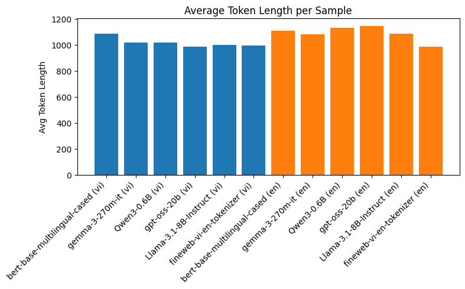

# fineweb-vi-en-tokenizer

This tokenizer was trained on [thng292/fineweb-subset-1M](https://huggingface.co/datasets/thng292/fineweb-subset-1M)

## How to reproduce

Checkout [Vietnamese only training script](./training.ipynb) and [Vietnamese + English training script](./training.ipynb)

## Benchmark with other tokenizers

